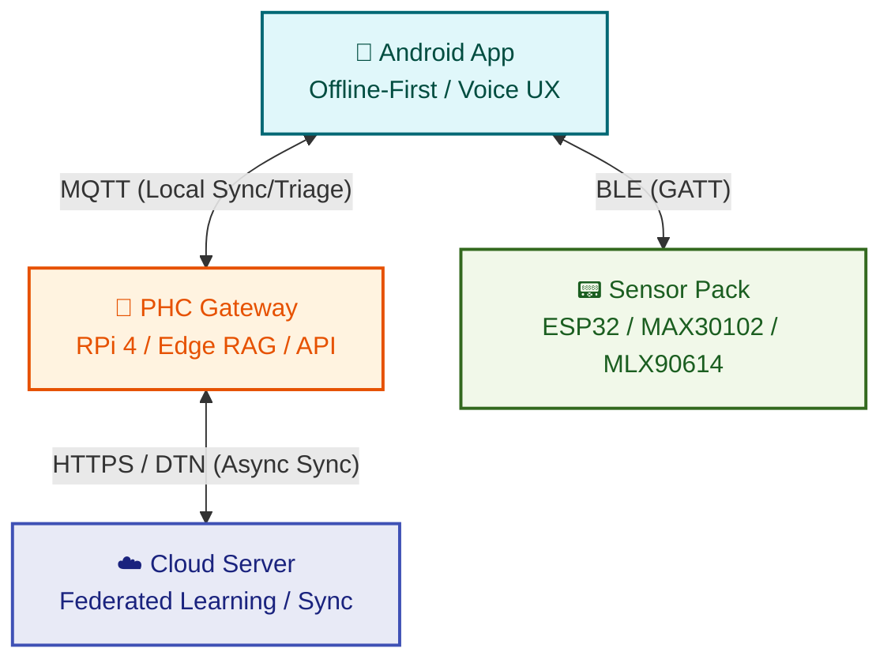

<!-- markdownlint-disable MD033 MD036 MD041 MD042 MD060 -->

<div align="center">

# 🏥 A Privacy-Preserving Federated Multi-Agent EdgeRAG Co-Pilot for Offline-First Rural Primary-Care Triage in India

**Empowering ASHA Workers with Offline-First, AI-Driven Clinical Support**

[](#)
[](#)
[](#)
[](#)
[](#)

</div>

## 📖 Introduction

AyushBot is a unified hardware-software ecosystem designed specifically for rural Indian healthcare environments. By combining a low-cost vital sensor pack, an edge-hosted local LLM/RAG pipeline (Raspberry Pi 4 gateway), and an offline-first Android application, AyushBot enables Accredited Social Health Activists (ASHAs) to conduct high-quality, evidence-based triage without requiring persistent internet connectivity.

## 🏗️ System Architecture

This monorepo is divided into specialized modular components:



## 📂 Repository Structure

Each directory represents a decoupled component of the system. Click on any directory below to dive into its detailed documentation:

| Directory | Core Purpose | Technologies |
| :--- | :--- | :--- |
| **[`/android`](android/README.md)** | 📱 The ASHA tablet interface, managing local state, UI, and BLE sensor pairing | Kotlin, Jetpack Compose, Room, WorkManager |
| **[`/backend`](backend/README.md)** | 🧠 Edge gateway logic (RPi 4) executing LLM/RAG, Agentic protocols, and MQTT ingestion | Python, FastAPI, LangGraph, EdgeRAG, XGBoost |
| **[`/cloud`](cloud/README.md)** | ☁️ Central server orchestrating cross-PHC Federated Learning and model aggregation | Python, Flower (FL), Docker |
| **[`/firmware`](firmware/README.md)** | 📟 Embedded C++ for the wearable sensor pack handling raw physiological signal capture | PlatformIO, C++, TinyML (TFLite Micro) |
| **[`/ml`](ml/README.md)** | 📈 Offline model training pipelines and data processing scripts for XGBoost risk markers | Scikit-learn, XGBoost, Pandas, Jupyter |
| **[`/infra`](infra/README.md)** | 🛠️ Deployment scripts and Docker configurations for reproducible deployments | Docker Compose, Shell, Mosquitto, Redis |
| **[`/docs`](docs/README.md)** | 📚 Master documentation, design specs, user guides, and architecture decision records | Markdown, Mermaid |
| **[`/data`](data/README.md)** | 🏥 Local storage directory mapped to `.gitignore` for managing raw ingestion datasets | Parquet, SQLite, Medical text corpus |
| **[`/research`](research/README.md)** | 🔬 Scratchpad for experimental notebook analysis, LLM prompt tuning, and hardware prototyping | Jupyter, PyTorch |
| **[`/tests`](tests/README.md)** | 🧪 Integration, unit, and end-to-end tests across all micro-components | Pytest, JUnit, Espresso |

## 🚀 Quick Start

To bootstrap local development across gateway + Android frontend:

```bash
# 1) Install dependencies
make install

# 2) Start local PHC gateway stack (Redis + Mosquitto + FastAPI)
make dev-gateway

# 3) Build and install Android app
cd android
./gradlew assembleDebug
./gradlew installDebug
```

For advanced deployment instructions, refer to [`/infra`](infra/README.md).

## 🎨 Frontend Design Authority

The Android frontend is implemented against these canonical documents:

- `android/docs/ayushbot-design-specs-legendary.md` (UI implementation authority)
- `android/docs/ayushbot-branding-guide-legendary.md` (brand/voice authority)

The Android module README is updated to match the implemented screen/state architecture:

- [`android/README.md`](android/README.md)

## 📚 Documentation Map

| Document | Purpose | Audience |
|---|---|---|
| `android/docs/ayushbot-design-specs-legendary.md` | Frontend UI/UX implementation contract | Android engineers, QA |
| `android/docs/ayushbot-branding-guide-legendary.md` | Brand strategy, tone, governance | PM, design, comms |
| `android/README.md` | Android app architecture, screens, build/test flow | Android developers |
| `docs/agentic-architecture.md` | Multi-agent system architecture | Backend/ML engineers |
| `infra/README.md` | Deployment and infra operations | DevOps/platform |

## 🛡️ License

AyushBot is released under the MIT License. See `LICENSE` for more information.
