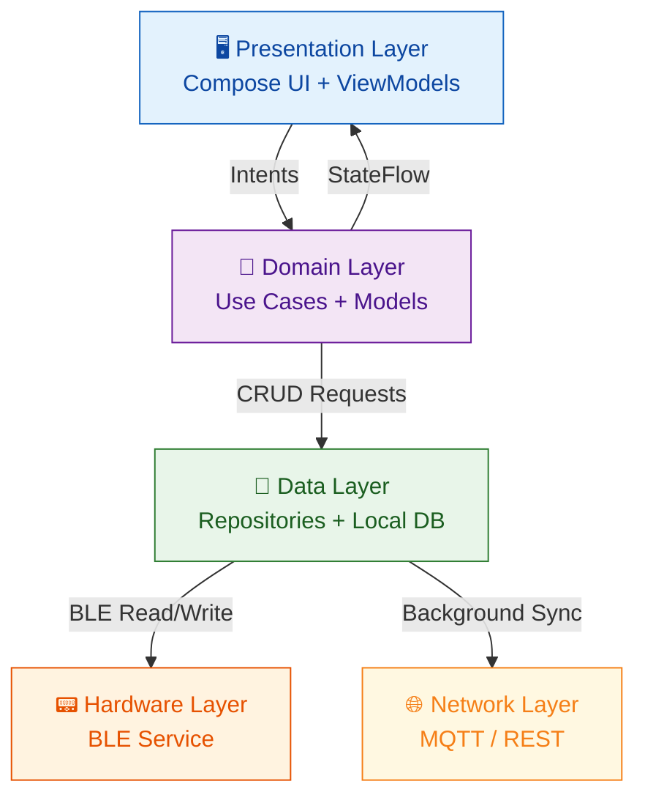

<div align="center">

# 📱 AyushBot Android Client

**Offline-First Native Android Interface for ASHA Workers**

</div>

## 📌 Overview

The `/android` directory contains the native Android application used by ASHA workers. It is built using **Kotlin** and **Jetpack Compose** (Material Design 3). The core philosophy of this app is to serve as an independent, offline-capable unit that can operate entirely without internet connectivity, relying solely on local network (MQTT) protocols for edge syncing and BLE for hardware interfacing.

## 🏗️ App Architecture

The app follows Clean Architecture principles, leveraging the Model-View-ViewModel (MVVM) pattern combined with Unidirectional Data Flow (UDF) for robust UI state management.



## 🧩 Core Components

### 1. UI & Design System (`ui/`)
- **Theme (`ui/theme/`)**: Implements an invariant clinical status color palette (Green, Amber, Orange, Crimson) alongside a standard Material 3 system. Dynamic Color is explicitly disabled to prevent misinterpretation of medical alerts.
- **Custom Components (`ui/components/`)**: Houses reusable widgets like `RiskBadge.kt` (pulsing critical animations), `VitalGauge.kt` (custom canvas circular gauges), and `SymptomCard.kt`.

### 2. Local Database (`data/local/`)
Encrypted local persistence layer leveraging **Room**.
- **`PatientEntity`**: Stores core demographics.
- **`CaseEntity`**: Captures timestamped triage events in an offline-first manner.
- **`RecommendationEntity`**: Caches edge-LLM generated action plans.

### 3. Background Services
- **WorkManager Sync**: Manages Delay-Tolerant Networking (DTN) bulk uploads to the PHC Gateway when the device rejoins the local offline intranet.
- **BLE Foreground Service**: Maintains a persistent persistent connection to the ESP32 sensor pack to prevent Android OS culling.

## 🚦 Navigation Flow

1. **Splash/Onboarding**: Language Selection (13 native options) $\rightarrow$ ASHA ID Form $\rightarrow$ Local Gateway Discovery.
2. **Dashboard**: Home feed managing recent cases, quick actions, and sync status.
3. **Triage Wizard**: Step-by-step diagnostic capture (Vitals + Symptoms) concluding with a unified Risk Assessment Card.
4. **Voice Query**: Chat-style interface hooking directly into the Edge-Hosted RAG via local API.

## 🛠️ Build Instructions

Ensure you have Android Studio installed and targeting Java 17.

```bash
# Navigate to directory
cd android

# Build Debug APK
./gradlew assembleDebug

# Run unit tests
./gradlew testDebugUnitTest
```
