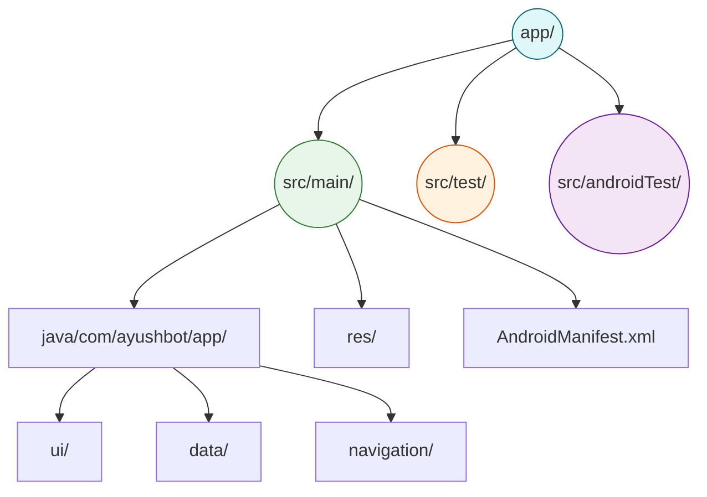

# 📱 Android App Module

**The Core Application Codebase for the ASHA Tablet Interface**

## 📌 Overview

The `/android/app` directory contains the actual source code, resources, and manifest for the AyushBot Android application. This is the modular heart of the frontend, separating the Android-specific execution logic from the root Gradle configurations.

## 🏗️ Module Architecture

## 🧩 Directory Contents

- **`src/main/java/`**: Kotlin source code following MVVM and Clean Architecture.
  - **`ui/`**: Jetpack Compose screens, generic components, and the customized Material 3 Design System.
  - **`data/`**: Room persistent database entities, DAOs, and UI State models.
  - **`navigation/`**: Type-safe Compose Navigation routing logic mapping.
- **`src/main/res/`**: Android external resources.
  - **`values/`**: Global color definitions, font certification arrays for Google Fonts (JetBrains Mono/Noto Sans), and static strings.
  - **`mipmap/`**: Adaptive launcher icons.
- **`build.gradle.kts`**: The module-level build script defining `compileSdk`, Compose dependencies, and ProGuard rules.

## 🛠️ Build Artifacts

When you run `./gradlew assembleDebug` from the parent directory, this module compiles the final APK. All generated UI code and Room SQLite boilerplate is written to `app/build/generated/`, which is strictly ignored via Git.
