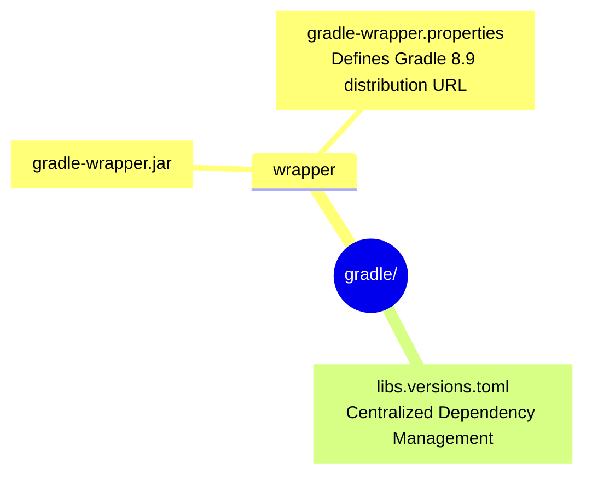

# 🐘 Android Gradle Configuration

**Build System Properties and Version Catalog**

## 📌 Overview

The `/android/gradle` directory houses the core configuration files that define how the Android application is built. Instead of hardcoding dependency versions across multiple modules, AyushBot employs a modern **Version Catalog** strategy.

## 🗂️ Key Files

### 1. `libs.versions.toml`
The single source of truth for all external libraries used in the Android project.
- **`[versions]`**: Defines exact semantic versions for strict reproducibility (e.g., AGP 8.7, Kotlin 2.1, Compose BOM).
- **`[libraries]`**: Associates maven coordinates with the versions above (e.g., `androidx.core.ktx`).
- **`[plugins]`**: Registers gradle plugins (Android Application, Kotlin Android, Compose Compiler).

### 2. `wrapper/`
Contains the wrapper jar and properties. Using `./gradlew` ensures that any developer or CI/CD pipeline builds the project using the exact same Gradle version (8.9) defined here, preventing "works on my machine" version skew errors.

## 🛠️ Updating Dependencies

To update a library across the entire Android project, you only need to change the version string inside `libs.versions.toml`. Project sync will cascade the change to the `app/build.gradle.kts`.
