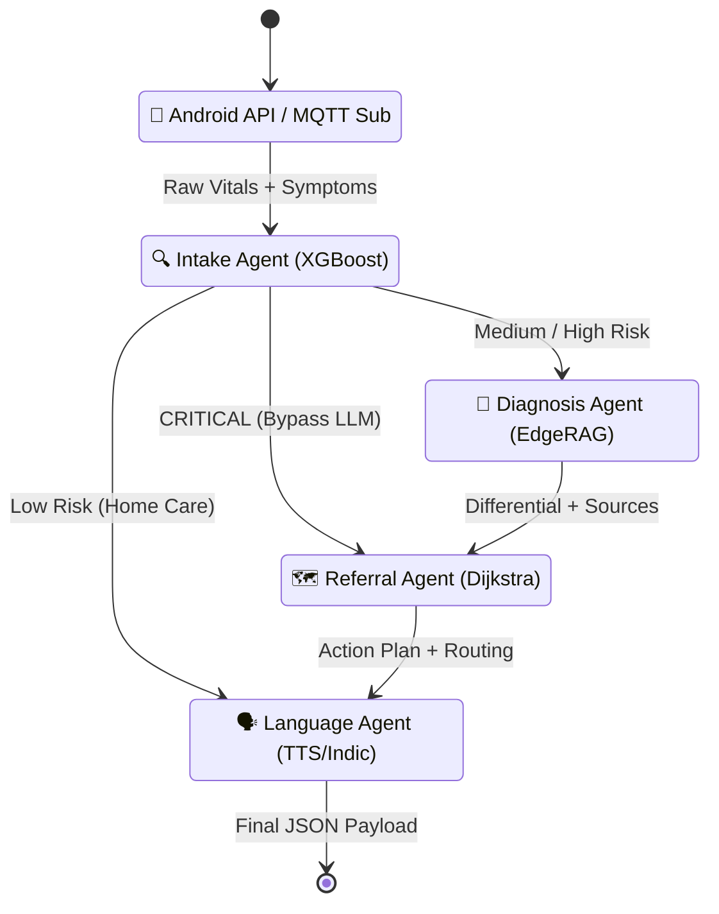

<div align="center">

# 🧠 AyushBot PHC Gateway (Backend)

**The AI Nervous System: Edge RAG, Agentic Triage & Data Routing**

</div>

## 📌 Overview

The `/backend` directory encompasses the entire server-side application built to run on a resource-constrained **Raspberry Pi 4 (8GB)**. Deployed at local Primary Health Centers (PHCs), it acts as an offline router—ingesting MQTT streams from Android tablets via a local network and orchestrating a multi-agent AI pipeline to generate medical recommendations.

## 🤖 Agentic Pipeline Logic

The core logic rests on a deterministic state machine powered by **LangGraph**. User cases traverse a sequence of specialized functional agents.



## 🧩 Architectural Modules

### `agents/`
The LangGraph orchestration hub.
- `orchestrator.py`: Modulates State, routing logic, and exception handling.
- `agent_intake.py`: Executes lightweight ML feature engineering (XGBoost) for rapid critical stratification.
- `agent_diagnosis.py`: The LLM generation step synthesizing symptoms against the RAG context.

### `rag/` & `llm/`
- **RAG Engine**: Utilizes **FAISS** for fast, low-memory vector retrieval of embedded IMCI guidelines.
- **Inference Engine**: Responsible for loading quantized LLMs (e.g., Phi-3 Mini GGUF) via `llama.cpp` Python bindings, strictly enforcing context boundaries to mitigate hallucination risks.

### `db/` & `api/`
- Handles the **FastAPI** HTTP layer for standard REST calls and the internal **SQLite** (WAL mode) database interface leveraging SQLAlchemy ORM models.

### `fl/` (Federated Learning Client)
- Responsible for periodically caching local `agent_intake` XGBoost corrections.
- Operates a local Flower background task to transmit Differential Privacy (DP) gradients upstream via Delay-Tolerant Networking (DTN) when an internet uplink surfaces.

## 🛠️ Execution Context

The gateway runs behind a Docker Compose shell (see `/infra` for specifics). All Python scripts execute with strict limits to prevent Raspberry Pi thermal throttling.

```bash
# Start backend server manually
cd backend
poetry run uvicorn api.main:app --host 0.0.0.0 --port 8000 --reload
```
