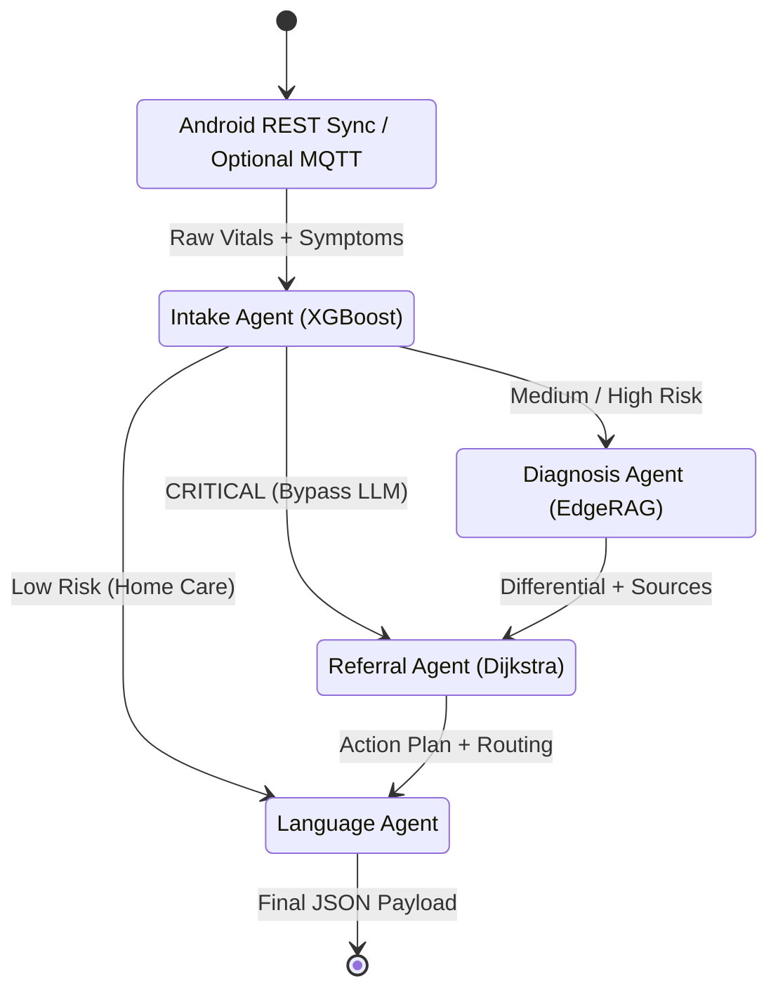

<div align="center">

# AyushBot PHC Gateway Backend

**The AI Nervous System: Edge RAG, Agentic Triage & Data Routing**

</div>

## Overview

The `/backend` directory contains the Python FastAPI service for the local PHC gateway. For this project, the backend should run on a laptop, desktop, mini-PC, or server-class local host. **An ESP32 is used as a BLE sensor node for Android**, not as the Python backend host.

The primary offline-first path is:

1. ESP32 sensor pack sends vitals to Android over BLE.
2. Android computes local deterministic triage and writes patients, cases, vitals, symptoms, and recommendations to Room first.
3. Android marks local records `PENDING`.
4. When Wi-Fi/server is available, Android syncs records to the backend using `/api/v1/sync/upload`.
5. The backend stores records, serves resource/model/reference manifests, and may run heavier optional workflows such as RAG or FL.

The backend also has an optional MQTT telemetry listener for lab diagnostics or direct sensor experiments. That path is not required for the core Android offline diagnosis flow.

## Agentic Pipeline Logic

The core logic rests on a deterministic state machine powered by **LangGraph**. User cases traverse a sequence of specialized functional agents.



## Architectural Modules

### `agents/`
The LangGraph orchestration hub.
- `orchestrator.py`: Modulates State, routing logic, and exception handling.
- `agent_intake.py`: Executes lightweight ML feature engineering (XGBoost) for rapid critical stratification.
- `agent_diagnosis.py`: The LLM generation step synthesizing symptoms against the RAG context.

### `rag/` & `llm/`
- **RAG Engine**: Utilizes **FAISS** for fast, low-memory vector retrieval of embedded IMCI guidelines.
- **Inference Engine**: Responsible for loading quantized LLMs (e.g., Phi-3 Mini GGUF) via `llama.cpp` Python bindings, strictly enforcing context boundaries to mitigate hallucination risks.

### `db/` & `api/`
- Handles the **FastAPI** HTTP layer for standard REST calls and the internal **SQLite** (WAL mode) database interface leveraging SQLAlchemy ORM models.

### `fl/` (Federated Learning Client)
- Responsible for periodically caching local `agent_intake` XGBoost corrections.
- Operates a local Flower background task to transmit Differential Privacy (DP) gradients upstream via Delay-Tolerant Networking (DTN) when an internet uplink surfaces.

## Execution Context

The Python gateway runs on the backend host. Android devices should point their backend base URL at the host IP, for example `http://192.168.1.20:8000/api/v1/`. ESP32 devices pair with Android over BLE.

```bash
# Start backend server manually
AYUSHBOT_CONFIG=backend/config.yaml python3 -m uvicorn backend.api.main:app --host 0.0.0.0 --port 8000 --reload
```

See `backend/api/ANDROID_SYNC_CONTRACTS.md` for the Android/backend HTTP contract. See `backend/api/ESP32_TELEMETRY_CONTRACT.md` only if you intentionally enable the optional direct-MQTT lab path.
