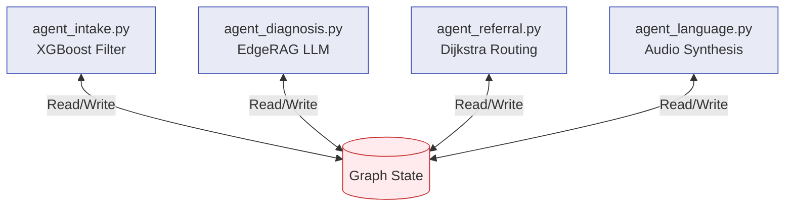

# 🤖 Backend Agents

**The LangGraph Node Implementations for Edge Triage**

## 📌 Overview

The `/backend/agents` directory contains the isolated logic units (nodes) that power the AyushBot LangGraph state machine. Each file represents a discrete step in the clinical triage pipeline, executing specialized operations like ML classification, spatial routing, or LLM generation.

## 🧠 Agent Topology

## 🧩 Agent Roles

### 1. `agent_intake.py` (The Gatekeeper)
- **Role**: Instantaneous risk stratification.
- **Logic**: Loads the lightweight XGBoost model weights (compiled from the `/ml` directory) and evaluates raw vital signs (SpO2, Temp, HR).
- **Execution**: If the patient trips "CRITICAL" thresholds, it bypasses the slower LLM generation entirely and fast-tracks the state to the Referral Agent.

### 2. `agent_diagnosis.py` (The Clinician)
- **Role**: Differential diagnosis extraction.
- **Logic**: Formats the patient symptoms into an optimized prompt, queries the FAISS index (via `/backend/rag`) for IMCI guidelines, and pipelines the context into the local `llama.cpp` inference engine.
- **Execution**: Produces a JSON-structured action plan and drug dosage recommendation.

### 3. `agent_referral.py` (The Navigator)
- **Role**: Spatial dispatch.
- **Logic**: Reads the ASHA's registered PHC location and queries local SQLite Facility entities to find the nearest higher-care facility capable of handling respiratory/critical emergencies using pre-computed routing logic.

### 4. `agent_language.py` (The Transliterator)
- **Role**: Localization.
- **Logic**: Formats the final clinical payloads into Hindi/regional languages and queues local TTS generation so the ASHA can play auditory instructions to the mother.
