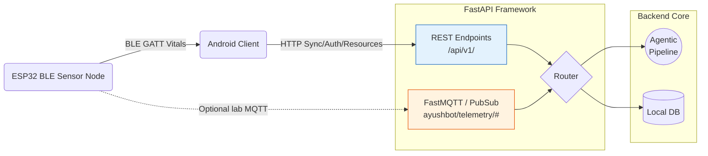

# Backend API Gateway

**The FastAPI Entrypoint and MQTT Message Broker**

## Overview

The `/backend/api` directory operates the networking backbone of the PHC gateway. The core production-shaped flow is Android-to-backend HTTP sync: Android stores visits locally first, computes offline triage locally, and uploads pending records when the gateway is reachable.

The ESP32 does not run the backend and is not expected to talk to the backend in the normal visit flow. It sends vitals to Android over BLE. An optional direct MQTT listener remains available for lab diagnostics and direct sensor experiments.

## API Architecture

## Component Details

### `main.py`
The FastAPI application root. It binds the routers, configures CORS for local intranet access, initializes the SQLAlchemy database dependency injection, and starts the background MQTT listener lifecycle.

### `routers/`
- **`sync.py`**: Endpoints dedicated to the Android tablet's background `WorkManager`. When a tablet reconnects to the PHC network, it dumps batched SQLite offline cases here.
- **`telemetry.py`**: Authenticated HTTP ingestion for telemetry routed through Android/tablet clients.
- **MQTT listener in `main.py`**: Optional direct telemetry ingestion for lab diagnostics. First-contact MQTT messages auto-register a local `SENSOR` device for development/showcase use; inactive or revoked devices are rejected.

### Android Sync Contract
See `ANDROID_SYNC_CONTRACTS.md` for route prefixes, auth, sync upload, manifest downloads, resource checksums, and optional triage calls.

### Optional ESP32 MQTT Contract
See `ESP32_TELEMETRY_CONTRACT.md` only for direct-MQTT lab mode. Normal hardware integration should use BLE from ESP32 to Android.

## Security
All endpoints are secured via JWT authentication. Tablets receive long-lived issuance tokens upon initial ASHA provisioning.
