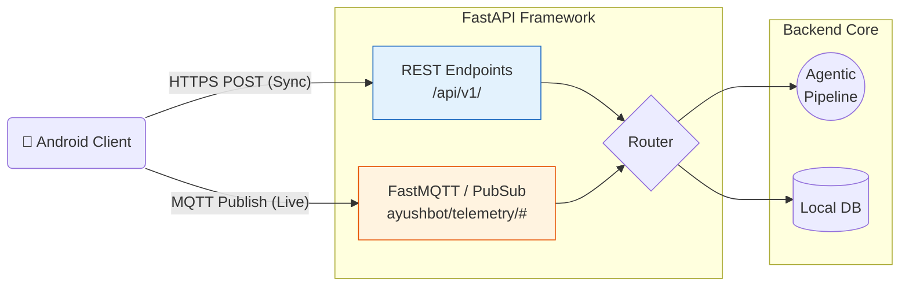

# 🌐 Backend API Gateway

**The FastAPI Entrypoint and MQTT Message Broker**

## 📌 Overview

The `/backend/api` directory operates the networking backbone of the PHC Gateway. Because AyushBot utilizes a Delay-Tolerant Networking (DTN) model for android clients, this module handles both standard synchronous REST calls and asynchronous MQTT ingestion streams.

## 📡 API Architecture

## 🧩 Component Details

### `main.py`
The FastAPI application root. It binds the routers, configures CORS for local intranet access, initializes the SQLAlchemy database dependency injection, and starts the background MQTT listener lifecycle.

### `routers/`
- **`sync.py`**: Endpoints dedicated to the Android tablet's background `WorkManager`. When a tablet reconnects to the PHC network, it dumps batched SQLite offline cases here.
- **`telemetry.py`**: Endpoints for handling raw, live streaming vital signals from the hardware sensor pack if routed through the tablet in live-monitoring mode.

### `mqtt_handler.py`
Connects directly to the local Mosquitto broker (defined in `/infra/docker-compose.yml`). Acts as the high-throughput ingestion pipe, appending messages to a local Redis queue where they are picked up by the LangGraph orchestrator.

## 🛡️ Security
All endpoints are secured via JWT authentication. Tablets receive long-lived issuance tokens upon initial ASHA provisioning.
