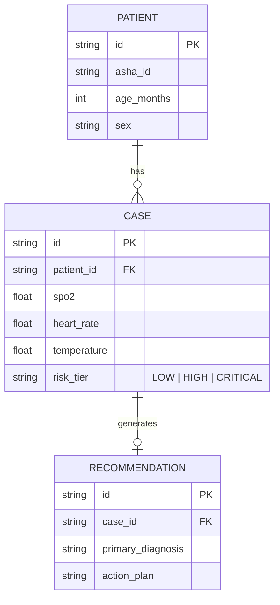

<div align="center">

# 🗄️ Backend Database

**SQLite Persistence & SQLAlchemy ORM for Edge Gateways**

</div>

## 📌 Overview

The `/backend/db` module manages all local data persistence on the Raspberry Pi 4 Gateway. Because AyushBot operates offline-first, a lightweight, highly concurrent local database is mandatory.

## 🧱 Database Architecture

AyushBot uses **SQLite** configured in **WAL (Write-Ahead Logging)** mode. This is a critical architectural decision ensuring that simultaneous rapid bulk-inserts from reconnecting Android tablets do not block read queries from the local FastAPI service.



## 🧩 Modularity

### `models.py`
Defines the SQLAlchemy declarative base and the mapped classes. These strictly mirror the Room entities defined in the `/android/app/src/main/java/com/ayushbot/app/data/local/entity/` directory to ensure seamless offline DTN syncing.

### `crud.py`
Standard Create, Read, Update, Delete abstractions utilized by the FastAPI router injection dependency (`get_db`).

### `migrations/`
**Alembic** environment configurations. When adding a new column to the edge schema, alembic migration scripts are rolled into the master Docker container image to seamlessly upgrade existing PHC Gateways in the wild without data loss.

## 🛠️ Usage

```python
# db/session.py
from sqlalchemy import create_engine
from sqlalchemy.orm import sessionmaker

# WAL mode is explicitly enabled in the engine connect args
engine = create_engine(
    "sqlite:///../../data/sqlite/ayushbot.db",
    connect_args={"check_same_thread": False, "timeout": 15}
)
```
