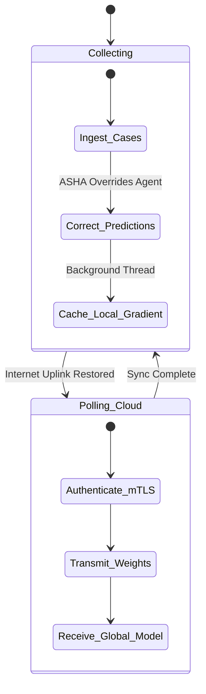

# 🤝 Backend Federated Learning (FL) Client

**Decentralized Intelligence Sync via Flower**

## 📌 Overview

The `/backend/fl` directory houses the local logic for the PHC Gateway's participation in global model aggregation. It transforms the edge Raspberry Pi into a **Flower (flwr)** node.

## 🔄 The Federated Lifecycle

Because AyushBot gateways often operate offline for weeks, they cannot participate in real-time synchronous FL rounds. Instead, this client implements an asynchronous, Delay-Tolerant Networking (DTN) approach.

## 🧩 Core Scripts

### `fl_client.py`
The Flower client bridging the local `agent_intake.py` XGBoost model to the global `/cloud` aggregator.
- **`get_parameters()`**: Extracts the local tree weights.
- **`fit()`**: When triggered by the central server, the client utilizes cached "corrections" (e.g., when an ASHA overrides an AI decision, effectively creating labeled ground truth) to retrain a small DP-noised differential gradient locally.
- **`evaluate()`**: Runs local validation to report isolated accuracy metrics back to the cloud.

### `privacy.py`
Implements **Differential Privacy (DP)** clipping. Before local weights are ever transmitted over the WAN, they are mathematically noised. This ensures that the central cloud server can never reverse-engineer specific patient vital signs from the transmitted ML parameters.

## 🛠️ Triggers
This client is not persistently active. It is triggered by a cron job/Docker scheduler only when a stable internet connection is detected on the Pi's networking interface.
