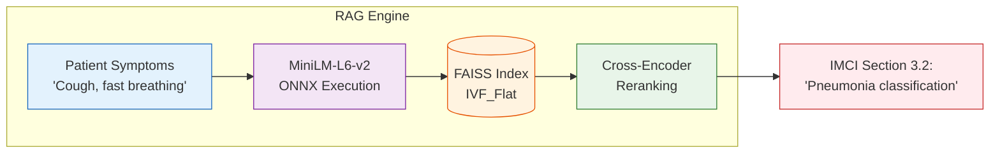

<div align="center">

# 📖 Edge RAG

**Retrieval-Augmented Generation for IMCI Guidelines**

</div>

## 📌 Overview

The `/backend/rag` directory implements the context engine that grounds the LLM in real-world clinical rules. Because raw LLMs hallucinate, AyushBot utilizes a vector-database-backed retrieval system to inject verbatim WHO IMCI (Integrated Management of Childhood Illness) protocols directly into the prompt context before inference.

## 🏗️ Retrieval Topology



## 🧩 Architectural Decisions

### `retriever.py`
To save RAM on the gateway, the embedding model used for vector distance calculation (`all-MiniLM-L6-v2`) is executed via **ONNX Runtime** rather than loading the full PyTorch library. 

### `build_index.py`
A build-time script (intended to be run on developers' laptops, not the Pi). It parses the raw PDFs/text inside `/data/assets`, chunks them semantically via LangChain's recursive splitters, and generates the flat `.faiss` artifact that the PHC Gateway will mount.

### `guardrails.py`
Post-retrieval validation logic. If the cosine distance of the retrieved documents is below a certain confidence threshold, this module overrides the LLM, instructing it to output "Inconclusive - Refer to MO" rather than guessing.

## 🛠️ Indexing Operations
*(Run on local host, NOT edge device)*
```bash
# Update the FAISS index with new WHO guidelines
poetry run python backend/rag/build_index.py --source data/assets/new_guidelines.pdf
```
