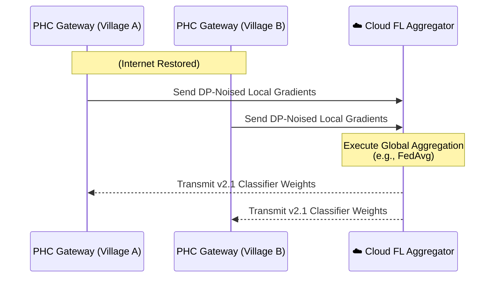

<div align="center">

# ☁️ AyushBot Cloud Sync Server

**Aggregate Global Medical Intelligence via Federated Learning**

</div>

## 📌 Overview

The `/cloud` block is uniquely restricted in scope. Because AyushBot is an offline-first platform focused purely on extreme-edge inference, there is **no centralized cloud backend handling API requests.** 

Instead, the cloud server serves a single asynchronous task: running a **Federated Learning (FL) Aggregation Server** to periodically collect anonymized performance markers from decentralized PHC Gateways.

## 🔄 Federated Learning Topology

The server implements a star-topology aggregation schema using the **Flower (flwr)** framework to refine the `agent_intake` XGBoost risk classifiers across the entire rural grid without centralizing patient datasets.



## 🧩 Modularity Breakdown

- **`server.py`**: The entrypoint running the persistent grpc socket server. Manages the orchestration of training rounds and determines cohort selection criteria.
- **`strategy.py`**: Implementation of aggregation math. Can swap between standard `FedAvg` and Byzantine-resilient algorithms (e.g., Trimmed Mean) to discard heavily drifted or corrupted PHC updates.
- **`auth/`**: mTLS certification mechanisms ensuring that only authenticated Pi 4 gateways can join an aggregation round.

## 🛠️ Execution

To spin up the centralized aggregation server (intended for an AWS/GCP instance):

```bash
cd cloud
poetry run python -m fl_server.server --port 8080 --strategy FedAvg
```
