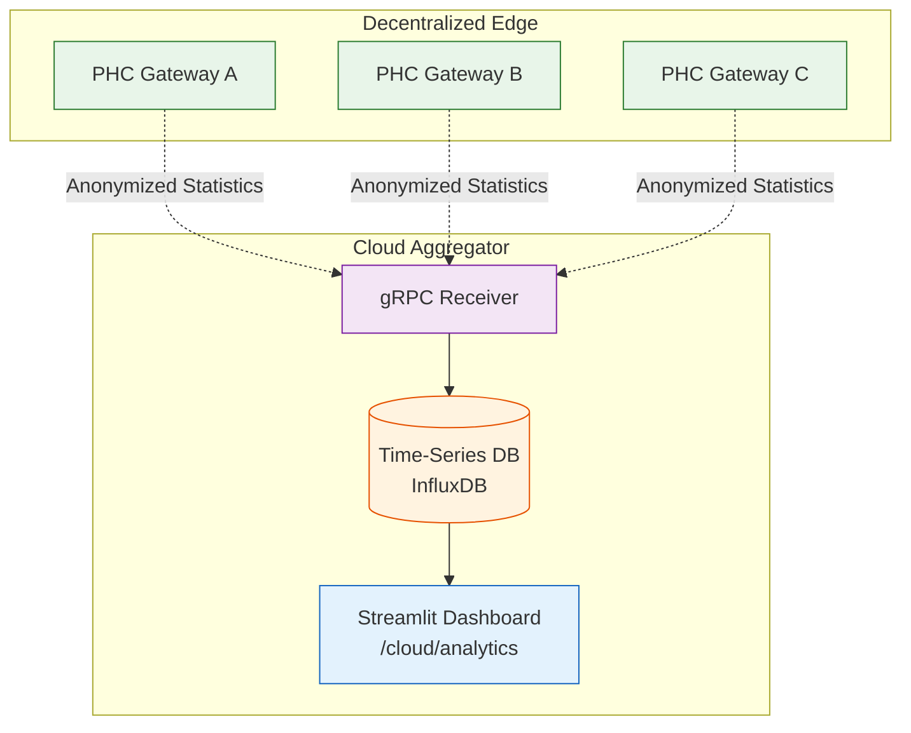

<div align="center">

# 📈 Cloud Analytics

**Global Visualization & Epidemiological Dashboards**

</div>

## 📌 Overview

Unlike the local edge gateways, the `/cloud/analytics` directory runs exclusively on the centralized aggregator server. Its purpose is to ingest the metadata arriving alongside federated updates to generate real-time (when connected) epidemiological heatmaps across the entire AyushBot deployment grid.

## 📊 Dashboard Architecture



## 🧩 Components

### 1. `ingestion/`
- Handles the parsing of JSON metadata arrays containing high-level stats (e.g., "Total cases this week", "Number of CRITICAL referrals", "Prevalence of cough vs diarrhea").
- **Crucial Rule**: No Personally Identifiable Information (PII) or Protected Health Information (PHI) ever hits this layer. 

### 2. `dashboard.py`
A lightweight **Streamlit** application designed for state-level health officers to monitor the grid.
- Plots interactive Folium map layers showing outbreak clusters.
- Visualizes battery degradation metrics of the ESP32 sensor packs mapped across villages.
- Tracks the drift divergence of the local `agent_intake` models against the global FL aggregated model.

## 🛠️ Running the Dashboard

```bash
cd cloud/analytics
poetry run streamlit run dashboard.py --server.port 8501
```
