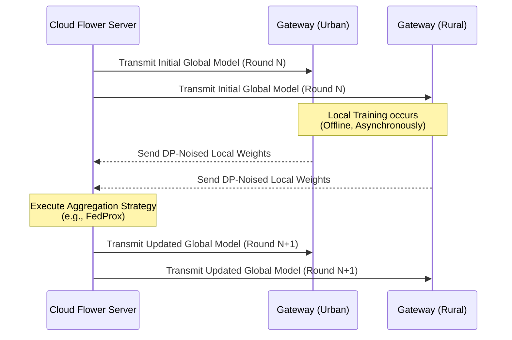

<div align="center">

# 🤝 Cloud Flower Server (FL)

**The Central Hub for Federated Aggregation**

</div>

## 📌 Overview

The `/cloud/fl_server` module orchestrates the **Federated Learning (FL)** ecosystem spanning across all distributed AyushBot PHC Gateways. It utilizes the **Flower (flwr)** framework to aggregate the distinct, localized machine learning experiences of hundreds of decentralized clinics into a single, robust global classifier.

## ⚙️ Aggregation Mechanics

Unlike traditional ML where all patient data is uploaded to a central server, AyushBot employs a privacy-first gradient exchange.



## 🧩 Module Implementation

### `server.py`
The entry point that binds the Flower gRPC listener.
- Configures the minimum threshold of gateways required before initiating an aggregation round.
- Defines the timeout windows given the highly erratic internet connectivity of rural nodes (using custom Flower `ServerConfig`).

### `strategy.py`
Houses the custom math implementations extending `flwr.server.strategy`.
- **FedAvg**: The standard Federated Averaging baseline.
- **FedProx**: Handles "stragglers" and heavy statistical heterogeneity (non-IID data) typical between distinct demographic geographies by adding a proximal term to the local objective functions.

### `callbacks/`
Hooks executed post-aggregation. E.g., automatically pushing the aggregated `.json` XGBoost artifact to an S3 bucket or evaluating the new global model against an untouched pristine validation dataset.

## 🛠️ Running the FL Server

```bash
cd cloud/fl_server
# Launch the aggregator listening on port 8080 using FedProx
python server.py --strategy FedProx --min-fit-clients 10 --rounds 50
```
