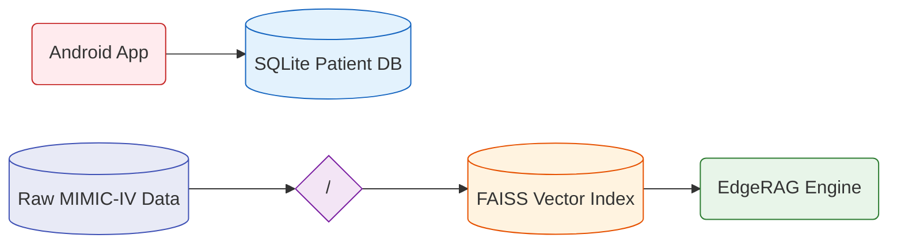

<div align="center">

# 📊 AyushBot Data Layer

**The Local Knowledge Vault: Clinical Storage & ML Artifacts**

</div>

## 📌 Overview

Because AyushBot is deployed in air-gapped or intermittently connected Primary Health Centers (PHCs), data persistence cannot rely on cloud databases. The `/data` directory acts as the central ingestion point for both raw datasets used in offline model training and the active local storage instances.

**⚠️ Security Note:** This directory is aggressively managed by `.gitignore`. No protected health information (PHI) or massive model weights should ever be committed to the repository.



## 🧩 Modularity Breakdown

### `/raw/`
The local target for large uncompressed datasets used by the `/ml` pipeline (e.g., MIMIC-IV vital marker pulls).

### `/assets/`
Clinical corpus staging area. Text documents, IMCI guidelines, and WHO PDFs are placed here before being chunked and embedded by `build_index.py` from the `/backend/rag/` module.

### `/indexes/`
The compiled **FAISS** vector store files (.faiss and .pkl). Required by the LLM Inference Engine to operate the diagnostic pipeline effectively.

### `/sqlite/`
The persistent storage mount for the PHC Gateway.
- Holds the `ayushbot.db` containing local encounter records, anonymized analytics, and Federated Learning logs.
- Operates in WAL (Write-Ahead Logging) mode to optimize concurrency during simultaneous Android bulk syncs.

## 🛠️ Data Handling Best Practices

When populating this directory locally prior to Edge deployment, run:

```bash
# Decompress dummy testing datasets
make unpack-data

# Build the FAISS indexes from the corpus
make build-rag
```
