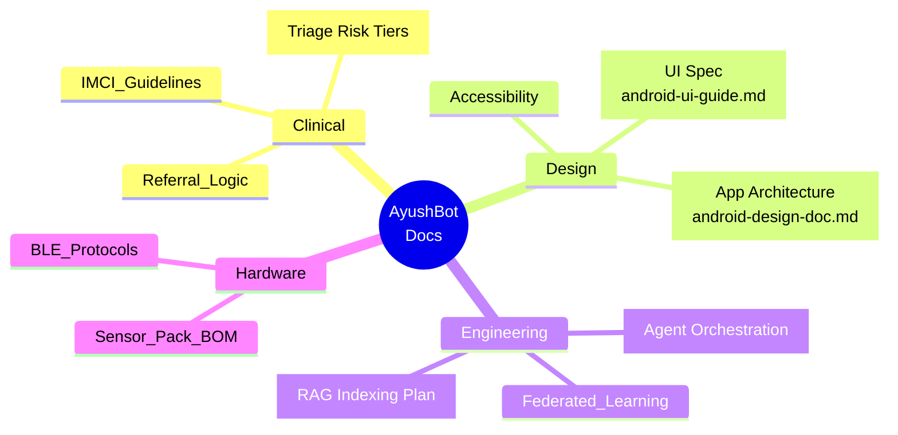

# 📚 AyushBot Documentation

**The Source of Truth: Architecture, Specs & Protocols**

## 📌 Overview

The `/docs` directory is the master knowledge base for the AyushBot project. It contains all high-level architectural decisions, clinical specifications, and user interface guidelines that dictate how the code across all other directories is written.

## 🗂️ Document Index

### 1. Design & UX
- **`android-ui-guide.md`**: The comprehensive Material Design 3 specification for the ASHA tablet application. Contains exact hex codes for the clinical status palette, typography scales (JetBrains Mono for vitals), and accessible interaction patterns.
- **`android-design-doc.md`**: The product requirements document (PRD) and UX flow mapping for the Android app, detailing screen layouts and offline navigation rules.

### 2. Clinical & AI Architecture
- **`PROJECT_COMPREHENSIVE_ANALYSIS.md`** *(In root)*: The global architectural overview.
- *(More specific RFCs and architectural decision records will be added here as the project matures)*

## ✍️ Contribution Standards

When adding new documentation:
1. Use **Markdown** strictly.
2. Embed **Mermaid** charts for all architectural diagrams instead of static images to allow version control tracking.
3. Keep clinical logic (e.g., IMCI rules) strictly separated from software implementation details to ensure medical reviews can be conducted independently of code reviews.
