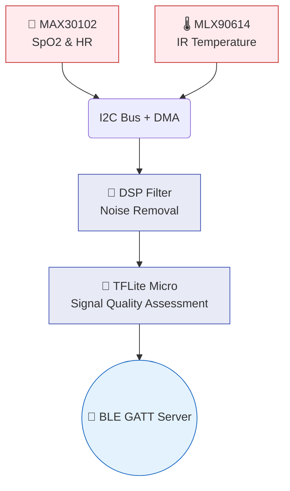

<div align="center">

# 📟 AyushBot Sensor Pack Firmware

**Bare-Metal Edge Computing for Physiological Capture**

</div>

## 📌 Overview

The `/firmware` directory holds the C++ code for the physical AyushBot wearable sensor pack. This small, battery-operated device (typically built around an ESP32 microcontroller) attaches to the patient to read raw vitals, process them through a local TinyML artifact, and transmit the stable readings to the ASHA's Android tablet via Bluetooth Low Energy (BLE).

## ⚙️ Hardware Pipeline



## 🧩 Key Components

### `src/`
- **`main.cpp`**: The primary Arduino/C++ sketch managing the `setup()` and `loop()` lifecycles, BLE advertising, and sleep states.
- **`config.h`**: The global configuration header defining pin assignments, I2C addresses, and critical clinical warning thresholds for the visual LED indicators on the hardware itself.

### `lib/`
*Submodules for vendor-specific drivers.*
- Custom, non-blocking I2C drivers for the MAX30102 (Pulse Oximetry) and MLX90614 (Infrared Thermopile).

### `tinyml/`
Holds the quantized TensorFlow Lite Micro (`.tflite` compiled to a C byte array) model used to reject spurious readings caused by patient motion artifacts *before* they are transmitted over BLE.

## 🛠️ Build & Flash

This project is configured using **PlatformIO**.

```bash
cd firmware

# Compile the firmware
pio run

# Upload to a connected ESP32 board
pio run --target upload

# Monitor serial output
pio device monitor -b 115200
```
