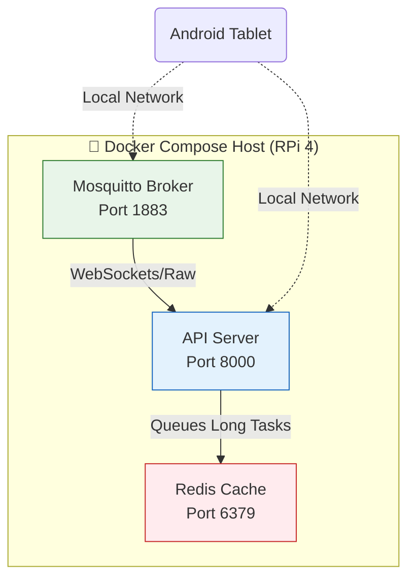

<div align="center">

# 🛠️ AyushBot Infrastructure

**Deployment Scripts & Docker Compositions for the Edge**

</div>

## 📌 Overview

The `/infra` directory contains everything needed to reliably deploy and orchestrate the AyushBot PHC Gateway onto a fresh Raspberry Pi 4. Because rural deployments lack dedicated IT support, the infrastructure must be entirely self-contained, reproducible, and resilient to sudden power loss.

## 🏗️ Container Orchestration

The gateway relies on a multi-container Docker Compose setup.



## 🧩 Directory Contents

- **`docker-compose.yml`**: The declarative configuration defining the FastAPI backend, Eclipse Mosquitto (MQTT broker for local Android sync), and Redis (for task queueing). Maps local `/data` volumes to ensure SQLite persistence across container restarts.
- **`rpi_setup.sh`**: A comprehensive bash script intended to be curled onto a completely fresh Raspberry Pi OS install. It automates:
  - Docker & Docker Compose installation.
  - Bluetooth system configurations for BLE proxying.
  - Creation of necessary static IPs and WiFi access point (hostapd) settings so the Pi can broadcast its own local intranet for the tablets.
  - TLS certificate generation for secure local MQTT.

## 🚀 Deployment Playbook

To flash a new PHC Gateway from scratch:

```bash
# SSH into the fresh Raspberry Pi
ssh pi@192.168.1.X

# Pull the setup script and execute
curl -O https://raw.githubusercontent.com/varunaditya27/AyushBot/main/infra/rpi_setup.sh
chmod +x rpi_setup.sh
sudo ./rpi_setup.sh
```

To manage the local development stack on your host machine:

```bash
cd infra
docker-compose up -d
docker-compose logs -f
```
