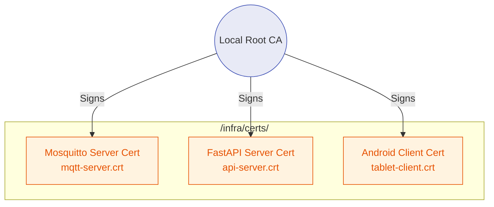

# 🔐 Infrastructure Certificates

**Local TLS and mTLS Asset Storage**

## 📌 Overview

The `/infra/certs` directory serves as the volume mount point for cryptographic assets used by the PHC Gateway's Docker containers. AyushBot enforces **TLS 1.2+** across all local connections (even air-gapped ones) to protect sensitive healthcare data traversing the local Pi WiFi hotspot.

**⚠️ Security Note:** This directory is aggressively managed by `.gitignore`. Private keys `.key` or `.pem` must NEVER be committed to version control.

## 🛡️ Certificate Topology

## ⚙️ Certificate Generation

During the initial gateway provisioning (`infra/rpi_setup.sh`), a local openSSL script generates the Root CA (Certificate Authority) and the necessary leaf certificates. 

These are injected into:
1. **Mosquitto Broker**: To enable `mqtts://` over port `8883`.
2. **FastAPI Server**: To enable `https://` on port `8443` for standard REST.

## 🔑 Provisioning Tablets

Because the Root CA is self-signed, Android Chrome and the OS will trust it by default. The `tablet-client.crt` and the public Root CA are packaged into a `.bks` (Bouncy Castle) keystore and deployed to the tablets via sideloading during an ASHA's onboarding. This establishes the foundation for Mutual TLS (mTLS) with the gateway.
