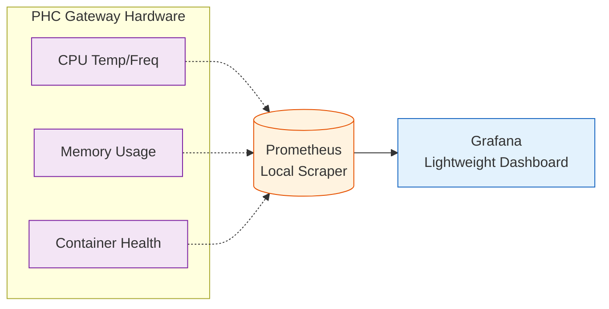

# 📊 Infrastructure Monitoring

**Observability Stack for Edge Gateways**

## 📌 Overview

The `/infra/monitoring` directory defines the local telemetry gathering tools used to oversee the health of the Raspberry Pi 4 operating in harsh rural conditions (dust, extreme heat, voltage fluctuations).

## 👁️ Telemetry Stack

Because we cannot rely on cloud-hosted dashboards like Datadog, the gateway runs a hyper-lightweight local monitoring stack sidecar alongside the main containers.

## 🧩 Components

- **`prometheus.yml`**: Defines the scrape intervals (e.g., every 60 seconds) targeting the `node_exporter` endpoint and the FastAPI `/metrics` route to track LLM token generation speeds.
- **`grafana_provisioning/`**: Pre-configured JSON dashboards ensuring the Medical Officer (MO) can instantly view thermal throttling events on the Pi without needing to manually build charts.

## 🌡️ Thermal Throttling Alerts

If the Pi 4 sustains 85°C, the SoC aggressively throttles clock speeds, severely dragging down `llama.cpp` inference speeds (from ~8 tokens/s down to <2 tokens/s). Prometheus is configured to trigger a system-level alert if temperatures ride above 80°C for more than 5 minutes, prompting the MO to adjust the physical placement of the gateway for better airflow.
