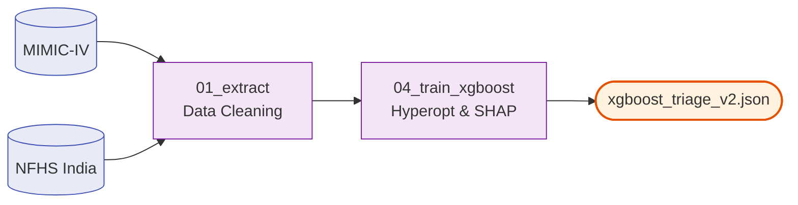

<div align="center">

# 📈 AyushBot Machine Learning

**Offline Training pipelines for Triage Classifiers & Federated Simulation**

</div>

## 📌 Overview

The `/ml` directory contains the data science pipelines responsible for creating the lightweight, interpretable models used by the `agent_intake` in the backend. These scripts are run strictly on high-power workstations or cloud environments to generate the artifact weights that are subsequently deployed to the edge.

## ⚙️ The Triage Modeling Pipeline

The primary model is an **XGBoost Classifier** trained to map raw vital signs (SpO2, HR, Temp) and discrete IMCI symptom flags to the 4-tier AyushBot Risk Protocol (Low, Monitor, Refer, Emergency).



## 🧩 Pipeline Modules

### `triage_classifier/`
- **`01_extract_mimiciv.py`**: ETL script connecting to the raw MIMIC-IV database (configured in `/data`) to extract pediatric triage encounters, clean anomalous sensor readings, and harmonize columns.
- **`04_train_xgboost.py`**: The core training script. Utilizes cross-validation, hyperparameter tuning, and computes **SHAP** (SHapley Additive exPlanations) values to verify that the model's decision boundaries align with clinical logic.

### `fl_simulation/`
Files for testing the distributed aggregation math prior to massive cloud deployment.
- **`run_fedavg.py`**: Spins up a mock Flower simulation to evaluate how the global XGBoost model shifts when aggregating heavily skewed non-IID (Independent and Identically Distributed) data representing distinct rural and urban phenomenologies.

## 🛠️ Execution

To establish the data science environment and execute a training run:

```bash
cd ml

# Extract data (requires proper MIMIC-IV credentials setup in env)
python triage_classifier/01_extract_mimiciv.py

# Train the local model
python triage_classifier/04_train_xgboost.py
```
