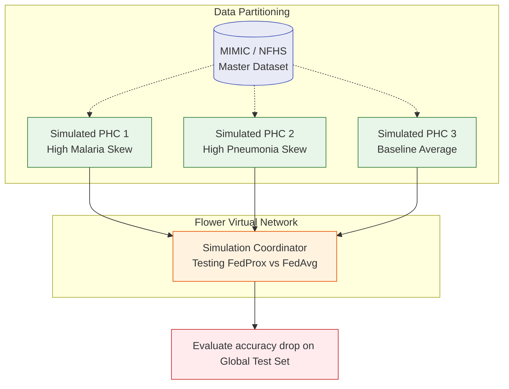

# 🌐 Federated Learning Simulation

**Prototyping Global Model Aggregation**

## 📌 Overview

The `/ml/fl_simulation` directory contains the data science scripts utilized to simulate the decentralized Federated Learning (FL) network *before* attempting live, over-the-air updates across the physical PHC gateways. It is a vital step in ensuring global stability for the `agent_intake` XGBoost classifiers.

## 🧪 Simulation Mechanics

Because real-world rural health data is inherently **Non-IID** (Independent and Identically Distributed)—meaning a clinic in Assam sees vastly different endemic diseases (Malaria/Dengue) than a clinic in Rajasthan—standard averaging algorithms can easily corrupt the global model.

## 🧩 Scripts

- **`partition_data.py`**: A utility to deliberately bias standard datasets (like MIMIC-IV) and slice them into dozens of isolated silos to mimic the Non-IID nature of rural India.
- **`run_simulation.py`**: Executes the `flwr.simulation.start_simulation()` method on a single high-power machine. It spins up hundreds of virtual Flower clients in parallel CPU threads to stress-test aggregation mechanics.
- **`evaluate_strategies.ipynb`**: Notebook validating the performance deltas between standard `FedAvg` (which often degrades on skewed data) against proximal term solutions like `FedProx`.

## 🛠️ Execution Context
This simulation requires a workstation with significant RAM and preferably GPU acceleration (via XGBoost `tree_method="gpu_hist"`) to handle the multi-client overhead.
