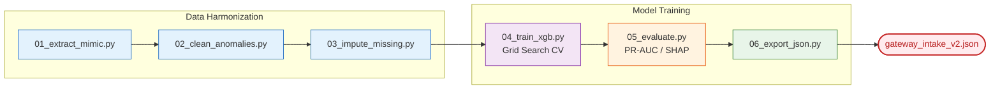

# 🎯 Triage Classifier Training

**The Offline XGBoost Foundry**

## 📌 Overview

The `/ml/triage_classifier` directory is the core data science engine of AyushBot. It holds the end-to-end Python pipeline that transforms massive, unstructured clinical datasets into the highly optimized, explainable **XGBoost Tree `.json` artifact** utilized by the `agent_intake.py` node on the Raspberry Pi gateways.

## ⚙️ Training Flow

Creating a clinically safe triage model requires heavily scrutinized steps.

## 🧩 Pipeline Components

- **`01_extract_mimic.py`**: Cross-references patient admission demographics with ICU charting events to isolate pediatric populations (0-5 years) presenting with respiratory/fever symptoms.
- **`04_train_xgb.py`**: Orchestrates hyperparameter search. It implements massive class weighting because `CRITICAL` state encounters represent less than 5% of all triage cases. Accurate identification of minorities is crucial.
- **`05_evaluate.py`**: Generates confusion matrices mapping against WHO IMCI ground truth classifications, not just the model's raw probability logs.
- **`06_export_json.py`**: Converts the Scikit-learn/XGBoost object into a universally readable `.json` graph of decision trees for native parsing via `xgboost.Booster()` on the edge gateway without requiring massive ML libraries.

## 🛠️ Execution Context
Due to the sheer number of grid search fits (500+ iterations), running the complete pipeline from 01 through 06 is computationally intensive and should be handled on cloud instances with multi-core CPUs.
