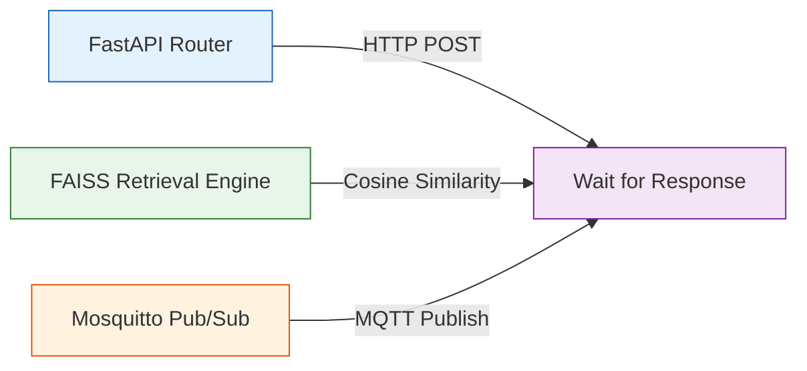

# 🔗 Integration Testing

**Validating Multi-System Handshakes**

## 📌 Overview

The `/tests/integration` directory validates that the highly decoupled modules of the AyushBot ecosystem (e.g., SQLite WAL databases, FAISS Vector retrieval, and LangGraph orchestrators) function correctly when wired together on the PHC Gateway.

Unlike `unit` tests which aggressively mock out dependencies, integration tests hit real local ports and spin up real in-memory databases to ensure the "connective tissue" of the system hasn't rotted.

## ⚙️ Testing Domains

## 🧩 Test Suites

### `test_db_concurrency.py`
Simulates the exact scenario where 5 ASHA Android tablets walk into a clinic simultaneously and begin dumping cached SQLite encounters. Asserts that the SQLAlchemy WAL configuration genuinely prevents `(sqlite3.OperationalError) database is locked` exceptions.

### `test_rag_pipeline.py`
Initializes a temporary `.faiss` object, populates it with 3 distinct IMCI guidelines, and asserts that querying "rapid breathing" pulls the correct `Document` node within the top-3 `k` results, ensuring semantic search logic hasn't degraded.

### `test_mqtt_ingestion.py`
Utilizes an asynchronous `paho-mqtt` client to fire JSON payloads exactly matching the Android app schema into the Mosquitto broker, validating that the FastAPI background worker dequeues and parses them correctly.

## 🛠️ Execution Requirements
These tests require actual backend services (Redis, Mosquitto) to be running via `docker-compose.yml` or spun up dynamically via `pytest` fixtures.
