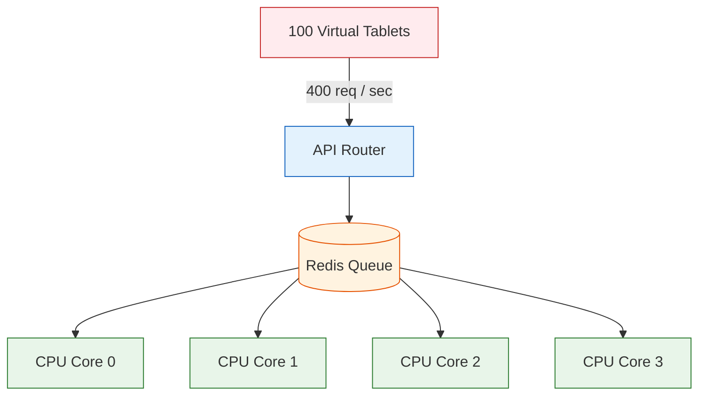

# 🌍 Load Simulation Testing

**Stress-Testing the Edge**

## 📌 Overview

The `/tests/simulation` directory validates the ultimate breaking points of the AyushBot software. When a localized disease outbreak (e.g., Dengue season) hits a village, the PHC Gateway will experience an exponential surge in data ingestion requests and LLM generation queues.

These test suites simulate high-load events to measure performance degradation, thermal throttling cascades, and memory leaks.

## 🧪 Simulation Modules

### `locustfile.py`
Uses the **Locust** distributed load testing framework to spawn 100+ virtual "ASHA Tablets" that continuously fire Delay-Tolerant Networking (DTN) sync payloads at the FastAPI `/api/v1/sync` endpoint over the span of 10 minutes.

- **Acceptance Criteria**: The API HTTP 500 error rate must remain < 0.1%, and average response times must stay below 2000ms.

### `llm_stress_test.py`
Because `llama.cpp` entirely consumes all 4 CPU cores on the Raspberry Pi 4 during generation, this test spams the LangGraph orchestrator with conflicting, highly complex clinical cases to ensure the underlying Redis task queue doesn't drop requests. 

## 🛠️ Execution Warning

**Do not run these tests on a production Gateway.** They are designed to intentionally maximize system resources and will render the Pi completely unresponsive to real EKG/Bluetooth telemetry while active. 
